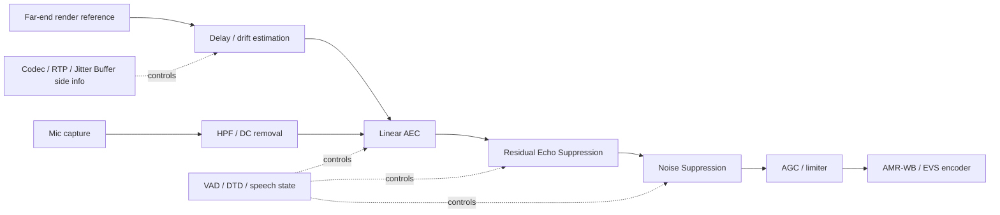
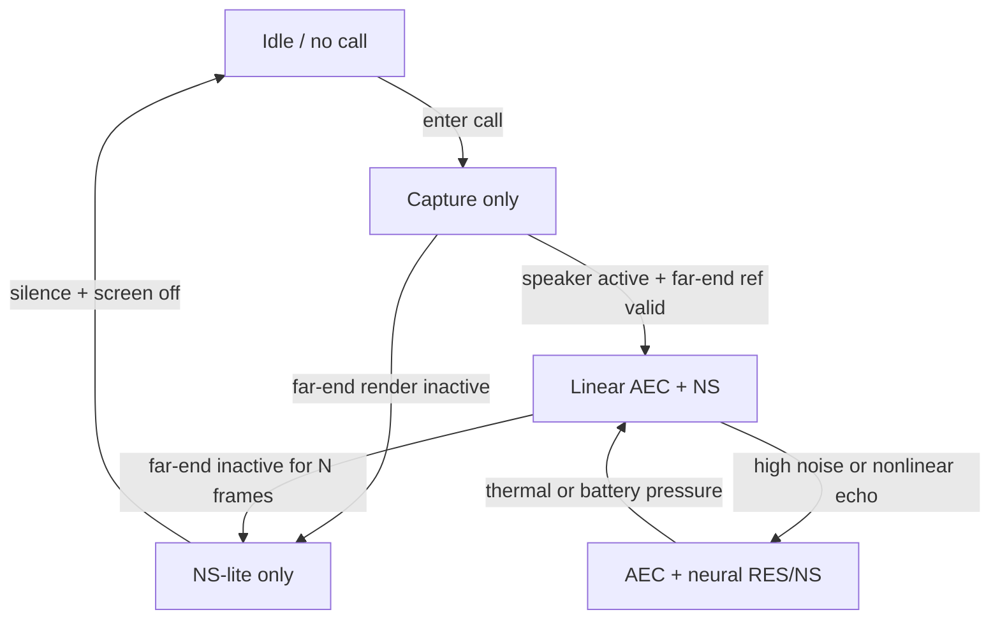

# 面向 VoLTE 与 VoNR 终端的 AEC 与 NS 算法研究报告

## 执行摘要

对手机与 IoT 终端的蜂窝语音链路而言，最稳妥的工程结论不是“单一神经网络取代一切”，而是**把线性 AEC 作为主干、把神经网络作为后处理或联合增强模块**。这是因为 entity["organization","3GPP","mobile telecommunications standards project"] 的 MTSI/IMS 语音栈要求终端同时面对 AMR、AMR-WB、EVS、RTP 20 ms 典型打包、抖动缓冲、丢包 concealment、全双工双讲和复杂的 far-end reference 路由；而这些问题里，**延时、时钟漂移、重采样和参考信号一致性**往往比单次离线语音质量更决定量产成败。entity["organization","ETSI","European Telecommunications Standards Institute"] 发布的 3GPP TS 26.114 要求终端支持 AMR、AMR-WB 与 EVS；EVS 总览和 JBM 规范则明确了 EVS 覆盖 8/16/32/48 kHz 输入、5.9 kb/s 到 128 kb/s 码率以及专门的 jitter buffer management。citeturn26view0turn21view2turn26view3turn23search0turn24search3

就算法路线看，**经典 DSP** 仍然是生产系统的基础：NLMS 适合低功耗与短尾长；RLS/Kalman 适合快收敛和路径突变；分块频域 AEC 是中长尾声学路径的主流工程做法；DTD 与 residual echo suppression 仍是量产中不可缺的保护层。与此同时，**现代神经/混合方案** 在非线性失真、残余回声和复杂非平稳噪声上已经明显领先：DTLN-AEC 把 DTLN 结构用于实时 AEC；NKF-AEC 把神经网络嵌入 Kalman 增益估计，模型仅 5.3K 参数且论文给出 RTF 0.09；DeepFilterNet 面向 48 kHz 全带宽低复杂度降噪；DPCRN 和 Conv-TasNet 变体在语音增强与 residual echo suppression 上有更高上限，但计算与内存压力也更大。citeturn18search8turn16search3turn16search10turn1search3turn14search1turn14search2turn14search6

对采用 urlArm Cortex-A55turn20search4 的终端而言，最佳量产策略通常分成三档：**基线档** 用 urlWebRTC AudioProcessing / AEC3 源码https://webrtc.googlesource.com/src/+/refs/heads/main/modules/audio_processing/；**低功耗档** 用经典 AEC 加轻量 NS（如 urlSpeexDSPturn12search20 + urlRNNoiseturn0search3）；**高质量档** 用“频域线性 AEC + 轻量神经后滤波”或 DTLN-AEC / NKF-AEC 一类混合方案。A55 的关键不是“能不能跑”，而是**单位有效语音秒的能耗**：NEON 向量化、10 ms 帧同步、单核亲和、模式切换、DVFS 友好批处理，以及只在需要时开启 AEC，是比单纯追求更高离线 MOS 更重要的设计目标。citeturn19search1turn19search3turn20search0turn20search1turn20search2turn20search5

公开资料层面，商业方案的可见度差异很大。urlNXPturn3search10 公开了面向 MPU 的 AI-AECNR 与 VoiceSeeker；urlCEVAturn6search2 公开了 ClearVox AFE/ENC 的多麦 AEC/NR 路线；urlCadenceturn3search2 更像提供 HiFi DSP + 软件框架的生态底座，而不是独立开放的 ECNR 产品；urlQualcommturn5search6 对外公开的是 cVc ECNS、AI-based ECNS、Voice Assistant Accelerator 与 32 kHz 语音能力；urlMediaTekturn4search12 的公开材料显示其 ADSP/SOF、far-field 算法和 DMNR 能力，但手机呼叫链路的 ECNR 细节公开较少。因而若目标平台是“纯 A55 + Linux/Android”，开源基线往往比 vendor marketing 更可操作；若目标平台带有专用 ADSP/NPU，则应优先把 ECNR 重负载下沉到专用核。citeturn3search0turn3search5turn6search2turn6search4turn7search0turn3search2turn5search2turn5search6turn5search1turn4search0turn4search3turn4search6

## 业务约束与系统边界

蜂窝端到端语音链路不是单一“降噪器”问题，而是**编解码、打包、抖动缓冲、回声参考、音频 HAL、音量/音效链路、重采样和时钟域**共同决定的系统问题。entity["organization","3GPP","mobile telecommunications standards project"] 的 TS 26.114 明确要求 MTSI 终端支持 AMR、AMR-WB；支持 super-wideband/fullband 语音的终端还应支持 EVS。AMR-WB 的 RTP clock rate 由 entity["organization","IETF","Internet Engineering Task Force"] RFC 4867 规定为 16 kHz；EVS 在 MTSI SDP 示例里通常也以 `EVS/16000/1` 出现，并在 EVS 总览里支持 8/16/32/48 kHz PCM 输入与多档码率。citeturn26view0turn24search3turn22view0turn21view2turn26view3

打包和缓冲直接影响 AEC 的可用余量。TS 26.114 的 SDP 与带宽示例反复使用 `ptime:20`，同时 MTSI MGW 侧要求在 NNI 上支持把最多 4 个非冗余语音帧封装到 RTP 包中，并建议端到端对齐 `ptime` / `maxptime`。EVS 规范单独定义了 Jitter Buffer Management，用于平滑到达抖动并保证连续播放；EVS 总览图还把 JBM、丢包 concealment、CNG 和解码链路并列作为接收端语音处理函数的一部分。对 AEC 来说，这意味着**AEC 延时预算必须和 codec + packetization + jitter buffer 一起看**，而不能仅看算法本身。citeturn22view0turn22view2turn23search0turn26view3turn26view4

在实时实现上，urlWebRTC AudioProcessing / AEC3 源码https://webrtc.googlesource.com/src/+/refs/heads/main/modules/audio_processing/ 给出的工程接口很能说明问题：APM 以**主/反向双流**逐帧处理，公开接口要求 10 ms PCM 块；AEC3 核心类也明确以 10 ms 帧作为输入。而旧版 AEC 接口甚至显式暴露了 sound-card delay 与 skew 参数，说明**延时估计与时钟漂移**从来不是边缘问题，而是 AEC 的一等公民。对 VoLTE/VoNR 客户端，这就要求 far-end reference 必须在“尽量接近真实扬声器驱动信号”的节点取得，并保证 capture/render 的时间基与采样率关系可被估计。citeturn19search1turn19search3turn11search3turn11search15turn0search6

下面的管线图给出了适合蜂窝语音终端的参考实现。它与 3GPP/JBM/WebRTC 的分工是一致的：编码/网络栈负责 packet/jitter，AEC/NS 负责 uplink 语音质量，二者必须共设计。citeturn19search3turn23search0turn26view3

## 算法全景与技术判断

### 经典 DSP 路线

经典 AEC 的主干仍是**自适应滤波 + 双讲保护 + 非线性残余抑制**。从工程角度，NLMS 的优势是实现简单、功耗可控、对短尾到中尾回声可用；RLS/Kalman 的优势是收敛和重收敛更快，但复杂度与数值稳定性成本更高；分块频域 AEC 则通过 FFT 把长尾路径建模从“每采样线性增长”的时间域问题，变成更适合中长尾的块处理问题，因此在免提电话、会议和智能终端中长期占主导。entity["organization","ITU-T","Telecommunication Standardization Sector of the ITU"] G.168 的定位就是“数字回声消除器的设计与测试要求”；更广泛的传输规划建议也把声学回声控制和数字回声消除并列为系统设计要点。citeturn9search13turn9search6turn2search16

在今天可见的开源实现里，经典路线的完整性最清楚地体现在 WebRTC AEC/AEC3 和 Athena-signal：前者的代码结构包含线性 echo removal、suppression gain、render analysis 和 10 ms 帧同步接口；后者的 README 直接列出 time delay estimation、linear echo cancellation、double-talk detection、ERLE 与 residual echo suppression。也就是说，**DTD 不是“锦上添花”，而是成熟 AEC 的标配保护机制**。citeturn11search11turn11search3turn12search0turn12search3

FxLMS 在电话/VoLTE 里不是传统 handset AEC 的主路线，但它在音频前端和主动噪声控制领域仍然重要，尤其是在“扬声器-声场-麦克风”闭环需要显式 secondary path 建模时。若产品同时兼顾车载、座舱、soundbar 或开放扬声器语音交互，FxLMS 的工程经验会帮助理解 why 仅靠单路线性回声模型不够。citeturn2search3turn2search11

### 神经与混合路线

现代路线可以粗分为三类。第一类是**“用神经网络做 NS，但保留传统 AEC”**，代表是 RNNoise、DeepFilterNet、很多 RNNoise fork。RNNoise 的价值不在理论最优，而在它把经典 DSP 特征与小型 RNN 组合在一起，形成可在实时 CPU 上运行的小而快的噪声抑制器；DeepFilterNet 则进一步把目标扩展到 48 kHz 全带宽、低复杂度深度滤波。对手机和 IoT 而言，这类方案很适合放在 AEC 后作为语音增强层。citeturn17search8turn0search3turn16search10turn16search2

第二类是**“线性 AEC + 神经 residual echo suppression”**。这类方案的思想最符合量产现实：让自适应滤波器处理大部分线性回声，再让小网络补偿扬声器非线性、路径失配和双讲下的残余回声。Technion 的 U-Net 残余回声抑制论文给出了很有工程价值的数字：136K 参数、1.6 GFLOP/s、10 MB 内存，并强调满足 AEC Challenge 时序和设备端资源约束；ICASSP 2022/2023 的挑战系统也大多采用“线性 filter + 神经 post-filter”架构，而不是端到端纯神经替代。citeturn14search2turn14search6turn14search10turn16search16

第三类是**联合或混合建模**。DTLN-AEC 直接把 DTLN 双域堆叠网络用于实时 AEC，并提供 TF-Lite 预训练模型；NKF-AEC 把神经网络嵌入 Kalman 增益估计，利用 Kalman 在双讲和路径突变上的鲁棒性，同时保持极小模型；DPCRN 与 Conv-TasNet 变体则代表了更高性能上限的时频域或时域深度模型，其中 Conv-TasNet 及其 AEC/RES 变体对非线性残余回声很有效，但通常更依赖部署优化与数据集匹配。citeturn18search8turn18search2turn16search3turn13search3turn1search3turn14search1turn14search5turn2search15

### 算法家族对比

下表给出适合 VoLTE/VoNR 终端的“工程视角”比较。表中的“成熟度”是本文基于标准化程度、代码可得性、部署复杂度与社区采用面的综合判断。citeturn9search13turn11search3turn17search8turn16search10turn16search3turn18search8turn14search2

| 算法家族 | 代表方法 | 质量上限 | 算法时延 | 复杂度/功耗倾向 | 适合 A55 的判断 | 依据 |
|---|---|---:|---:|---:|---|---|
| 经典时域 AEC | NLMS / APA | 中 | 很低 | 低到中 | 适合低功耗、短到中尾 | citeturn9search13turn12search0 |
| 经典高阶自适应 | RLS / Kalman | 中高 | 低 | 中到高 | 适合路径变化快，但需谨慎控功耗 | citeturn2search16turn16search3 |
| 分块频域 AEC | PBFDAF / FDKF 类 | 高 | 低到中 | 中 | **量产主流**，最平衡 | citeturn11search11turn14search15 |
| 轻量神经 NS | RNNoise | 中高 | 很低 | 低 | A55 很友好，适合作为后级 NS | citeturn17search8turn0search3 |
| 全带宽神经 NS | DeepFilterNet | 高 | 低到中 | 中 | 若目标是 32/48 kHz 高质量语音，可行 | citeturn16search10turn13search1 |
| 联合神经 AEC | DTLN-AEC | 高 | 低到中 | 中 | 适合原型/高质量模组，量产前要严测 | citeturn18search8turn18search2 |
| 神经 Kalman 混合 | NKF-AEC | 高 | 低 | 低到中 | A55 上最值得重点评估的“新经典” | citeturn16search3turn13search3 |
| 线性 AEC + 神经 RES | U-Net / GFTNN / Bark-scale PF | 高 | 低到中 | 中 | **最推荐的升级路线** | citeturn14search2turn14search6turn16search16 |
| 高性能时域网络 | Conv-TasNet 变体 | 很高 | 低到中 | 中到高 | 适合旗舰型或离线/边缘算力更强场景 | citeturn2search15turn14search1turn14search5 |
| 中高性能时频网络 | DPCRN | 很高 | 低到中 | 中到高 | 质量强，但比 RNNoise / NKF 更吃算力 | citeturn1search3turn1search11 |

## 指标、复杂度与功耗比较

在 AEC/NS 上，**单一指标不可用**。ERLE 衡量的是线性回声衰减能力，对评估适应速度和稳态抑制很有价值，但在双讲和非线性扬声器失真存在时，它不能代表终端实际主观体验；PESQ/ESTOI 更接近感知质量与可懂度；SDR/SI-SDR 对增强/分离类论文常见，但早已被指出如果使用不当会夸大差异；面向语音助手或通话转写时，ASR WER/WAcc 往往是更接近业务 KPI 的指标。微软 AEC Challenge 本身就把 MOS、词准确率等感知/任务指标引入排名。citeturn15search17turn15search0turn15search3turn15search11turn18search16turn14search6

对 A55 量产评估，建议把指标分成四层。第一层是**信号层**：ERLE、残余回声电平、dERLE（路径变化后恢复时间）；第二层是**感知层**：PESQ、ESTOI/POLQA；第三层是**任务层**：ASR WER / WAcc、双讲下 near-end 失真；第四层是**资源层**：实时因子 RTF、MMAC/s、峰值/平均内存、CPU 占用、mJ/秒有效语音。论文里能直接复用的复杂度数字并不统一，因此**量产前必须自己重新计算 deployed graph 的实际 MMAC/s 和 cache 访存行为**。例如：DTLN 论文给出“少于 100 万参数”；DPCRN 论文给出 0.8M 参数；NKF-AEC 论文给出 5.3K 参数与 RTF 0.09；某类 U-Net 残余回声抑制给出 1.6 GFLOP/s 与 10 MB 内存。citeturn18search0turn1search3turn16search3turn14search2

下表给出对 A55 最有参考价值的“量级”比较。这里的复杂度列刻意用“量级/已公开数字”而不强行统一成一个假精确数，因为不同论文对 MAC、FLOP、RTF 的统计口径并不一致。citeturn18search0turn1search3turn16search3turn14search2turn13search5

| 方案 | 已公开复杂度线索 | 典型延时倾向 | 内存压力 | 功耗倾向 | 备注 | 依据 |
|---|---|---:|---:|---:|---|---|
| NLMS / 频域 AEC | 随尾长与分块配置缩放；工程上最可控 | 低 | 低 | 低到中 | 线性主干首选 | citeturn11search11turn9search13 |
| RNNoise | 论文强调“小而快、实时、可在树莓派运行” | 很低 | 低 | 低 | 最适合做后级 NS | citeturn17search8turn17search6turn0search3 |
| DTLN | < 1M 参数 | 低 | 中 | 中 | 质量/功耗平衡较好 | citeturn18search0 |
| DPCRN | 0.8M 参数 | 低到中 | 中 | 中到高 | 增强质量强 | citeturn1search3 |
| NKF-AEC | 5.3K 参数，RTF 0.09 | 低 | 很低 | 低到中 | **A55 关注重点** | citeturn16search3 |
| 神经 RES U-Net | 136K 参数，1.6 GFLOP/s，10 MB | 低到中 | 中 | 中 | 很适合叠在线性 AEC 后 | citeturn14search2 |
| GTCRN | 48.2K 参数，33.0 MMAC/s | 低 | 很低 | 很低 | 虽非用户点名，但极适合低功耗备选 | citeturn13search5 |
| DeepFilterNet | 低复杂度全带宽 deep filtering | 低到中 | 中 | 中 | 48 kHz 质量优势明显 | citeturn16search10turn13search1 |

## 开源实现与商用方案盘点

### 开源实现与推荐用例

下表聚焦“能否落地到手机/IoT 呼叫链路”，而不是学术新颖性。许可证一栏只填写本次检索中能够高置信确认的结果；无法高置信确认者标为“待核验”。citeturn11search3turn12search20turn0search3turn13search1turn18search2turn13search3turn12search0turn12search2

| 实现 | 许可证 | 语言 | 平台/部署 | 成熟度 | 推荐用例 | 依据 |
|---|---|---|---|---|---|---|
| urlWebRTC AudioProcessing / AEC3 源码https://webrtc.googlesource.com/src/+/refs/heads/main/modules/audio_processing/aec3/ | BSD-style + PATENTS | C++ | Android / Linux / Browser 生态 | 很高 | 手机/IoT 语音通话基线 | citeturn11search5turn19search3turn11search3 |
| urlwebrtc-audio-processing 打包版turn19search0 | BSD-3-Clause | C/C++ | Linux / GStreamer / PipeWire 生态 | 高 | Linux 设备快速接入 | citeturn19search0turn12search15 |
| urlSpeexDSPturn12search20 | 待核验 | C | 嵌入式 / Linux / MCU 友好 | 高 | 低功耗 AEC/NS/AGC/VAD 基线 | citeturn12search20turn12search1 |
| urlRNNoiseturn0search3 | BSD-3-Clause | C | ARM CPU / Raspberry Pi / 桌面端 | 高 | 后级 NS、低功耗增强 | citeturn0search3turn17search8 |
| urlDeepFilterNetturn13search1 | MIT 或 Apache-2.0 | Rust + Python | Linux / x86 / ARM CPU | 中高 | 32/48 kHz 高质量 NS | citeturn13search1turn16search10 |
| urlDTLNturn18search4 | 待核验 | Python / TF / TF-Lite / ONNX | ARM CPU / Raspberry Pi | 中 | 轻量神经 NS 原型与量产候选 | citeturn18search4turn18search0 |
| urlDTLN-aecturn18search2 | 待核验 | TF-Lite 模型 | ARM CPU / 嵌入式原型 | 中 | 高质量 AEC 原型或 premium 模式 | citeturn18search2turn18search8 |
| urlNKF-AECturn13search3 | 待核验 | Python / 研究代码 | CPU 原型，适合移植 | 中 | A55 上重点评估的混合 AEC | citeturn13search3turn16search3 |
| urlAthena-signalturn12search0 | Apache-2.0 迹象，仍建议复核 | C / Python 包装 | 麦阵 / Linux / 嵌入式 | 中 | 研究与自建多模块前端 | citeturn12search0turn12search3 |
| urlOSLECturn12search2 | GPL | C | 线回声 / DAHDI / Asterisk 生态 | 中 | 电信线回声，不适合声学 AEC 主路线 | citeturn12search2turn12search17 |
| urlwerman RNNoise 插件分支turn17search20 | 见仓库 | C++/插件 | 桌面音频链路 | 中 | 验证 RNNoise 集成思路 | citeturn17search20 |
| urlArmDeveloperEcosystem RNNoise Pico 2 示例turn17search7 | BSD-3-Clause | C / CMake | 极低功耗 MCU | 中 | 评估 RNNoise 极限轻量化 | citeturn17search7 |

**结论非常明确**：如果目标是 VoLTE/VoNR 量产，开源里面最稳的入口仍是 WebRTC APM/AEC3；如果目标是低功耗而不是极致品质，SpeexDSP + RNNoise 的组合更易控电；如果目标是展示差异化语音体验，DTLN-AEC、NKF-AEC 或“经典 AEC + 神经 RES”比纯替换式端到端模型更现实。citeturn19search3turn12search20turn0search3turn18search8turn16search3turn16search16

### 商用与 IP 方案深挖

公开资料允许做出以下判断：urlNXPturn3search10 和 urlCEVAturn6search2 提供的是相对“成品化”的语音前端/ECNR 路线；urlCadenceturn3search2 提供的是 DSP/IP + 软件生态底座；urlQualcommturn5search6 和 urlMediaTekturn4search12 则更多通过平台集成能力对外展示语音增强，而不是开放源码或公开详细算法。若项目没有这些厂商的 BSP / SDK / NDA 文档，公开网页不足以替代真正的集成手册。citeturn3search0turn3search5turn6search2turn7search0turn5search2turn5search6turn4search0turn4search3

| 厂商 | 公开方案 | 公开技术信号 | 对 A55 项目的启示 | 依据 |
|---|---|---|---|---|
| urlNXPturn3search10 | urlAI-AECNRturn3search0、urlVoiceSeekerturn3search5 | AI-AECNR 强调 deep learning、无需调参、支持 full-duplex/two-way、16 kHz、variable echo path，并通过 i.MX Voice Plugin 部署；VoiceSeeker 强调多麦 beamforming + AEC | 如果平台是 i.MX / MPU，NXP 更接近“可直接采购并落地”的产品；若是纯 A55 自研板，NXP 文档提供了很好的产品形态参考 | citeturn3search0turn8search1turn3search5 |
| urlCEVAturn6search2 | urlClearVox ENCturn6search2、ClearVox AFE | 明确宣传 neural-network-based ENC、小内存/小算力；多份官方材料提到多麦 NR + AEC、不同麦克风几何和 echo tail tuning、并面向 BX1 DSP 优化 | 如果 SoC 内含 CEVA DSP，优先把 ECNR 下沉到 DSP；若没有 CEVA DSP，则更像 licensing 参考而非直接可用软件 | citeturn6search2turn6search4turn6search9turn6search13 |
| urlCadenceturn3search2 | urlHiFi DSPsturn3search2、urlHiFi 软件套件turn7search0 | 公开资料重点是 HiFi DSP 的能效、音频/语音/AI ISA、XAF、SOF 与 EVS/AMR 等 codec 生态。公开网页并未展示一个独立、开放的“Cadence ECNR 包” | 对 A55 项目意味着：若芯片带 HiFi DSP，ECNR 最好 offload；若没有 DSP，Cadence 更像 SoC 选型因素，而不是直接算法来源 | citeturn3search2turn3search22turn7search0turn7search5 |
| urlQualcommturn5search6 | cVc ECNS、Audio and Voice Communication Suite、Voice Assistant Accelerator、aptX Voice | 官方材料显示 AI-based ECNS、硬件加速 voice processing、up to 3-mic cVc ECNS、以及 32 kHz super-wideband voice for accessories | 如果目标平台是 Qualcomm 手机/耳机 SoC，应优先用平台原生 ECNS；对纯 A55 自研板，Qualcomm 更提供“行业上限”的产品参考，不是通用可复用软件 | citeturn5search2turn5search1turn5search4turn5search6turn5search11turn5search24 |
| urlMediaTekturn4search12 | urlGenio ADSP/SOF 音频处理turn4search0、url语音助手与 far-field 算法turn4search3、DMNR 白皮书 | 公开资料表明 ADSP 擅长 AEC/NS 低功耗处理；旧版 DMNR 白皮书展示了双麦 NR 和自动位置适配；但手机呼叫链路的 ECNR 细节公开较少 | 若平台带 MTK ADSP/NPU，应优先利用片上协处理；若是独立 A55 方案，可借鉴其“自动位置适配/多麦稳健性”思路 | citeturn4search0turn4search3turn4search6turn4search1 |

一个重要现实判断是：**商用品的优势主要不是“论文指标更高”，而是 call-path 集成与功耗工程更成熟**。例如 Qualcomm 与 MediaTek 更容易在音量曲线、speaker protection、codec route、BT/VoNR 协同中形成闭环；而开源方案的优势在于可验证、可重复和可控。对没有 vendor BSP 深度支持的 A55 项目，先拿开源建立可重复基线，再决定是否引入商用 IP，整体风险最低。citeturn5search2turn5search6turn4search0turn19search3turn12search20turn0search3

## Cortex-A55 落地与评测方法

### 在 A55 上的实现策略

urlArm Cortex-A55turn20search4 的公开定位就是“高能效中端 CPU”，并明确支持新的 NEON/ML 指令；urlArm Cortex-A55 软件优化指南turn20search0 与 Arm 的 NEON DSP 课程则直指滤波、采样率转换、音频编解码和数字信号处理优化。因此，对 A55 的第一原则不是“尽量上大模型”，而是**先把向量化和内存访问打满**。对经典 DSP 路线，优先做 NEON 化 FIR/FFT/复数乘加、分块 overlap-save/overlap-add；对神经模型，优先选用能够在 CPU 上稳定获得 NEON kernel 的运行时。citeturn20search4turn20search0turn20search2turn20search10

若采用 entity["software","TensorFlow Lite","mobile and embedded inference runtime"] / LiteRT，公开资料显示 XNNPACK 对 ARM NEON 做了专门优化，并覆盖卷积、depthwise、FC 等核心算子，且明确提到对 Cortex-A55/A75 一类移动核进行了优化；Arm NN delegate 也可以作为替代委托层。对于 DTLN、DTLN-AEC、小型 CRN/DPCRN 这类网络，**先验证 XNNPACK，再评估平台自带 NPU/DSP delegate**，通常比一开始就做自定义 runtime 更经济。citeturn20search1turn20search5turn20search3turn20search11

对语音帧长，工程上应以 **10 ms 为主帧**。这是因为 WebRTC APM 与 AEC3 的接口天然以 10 ms 为基本块；10 ms 也更利于 DTD、延时跟踪和 mode switch。20 ms 可以作为**网络/codec packetization**的自然单位，但不建议把 AEC/NS 主循环也粗化到 20 ms，除非经过严格双讲测试。对 A55 节能来说，正确做法不是“增大算法块长”，而是**在 10 ms 帧内尽快处理完成并让 CPU 回到更低活跃度**。citeturn19search1turn19search3turn11search3

### 建议的模式控制器

对功耗最有效的优化不是单点 SIMD，而是**按业务场景切换算法深度**。蜂窝通话栈天然存在 far-end inactive、near-end only、full duplex、speakerphone、高噪声等状态，AEC/NS 不应永远跑满。下面的模式图适合作为 A55 项目的控制框架。citeturn19search3turn23search0turn16search16

建议的模式定义如下：  
**基线模式**：经典线性 AEC + 轻量 NS；  
**省电模式**：无 far-end reference 时关闭 AEC，仅保留 VAD/NS-lite；  
**高质量模式**：在线性 AEC 后打开神经 RES/NS；  
**热保护模式**：保持 AEC，降低神经后处理强度或退回 RNNoise。这样的控制策略对功耗往往比单纯把模型量化到 INT8 更有效，因为它减少了“无意义的持续计算”。citeturn19search3turn17search8turn16search16

### A55 基准测试方法

建议把验证分为**离线可重复测试**与**在线功耗测试**两组。离线组至少应覆盖：far-end single-talk、near-end single-talk、双讲、回声路径突变、参考信号丢失/错路由、时钟漂移、采样率不一致、扬声器非线性失真、背景噪声叠加。背景噪声建议至少包含车内、道路、咖啡馆/食堂、风噪、键盘/HVAC；非线性测试建议包含扬声器限幅、压缩器、EQ 后参考不一致；双讲测试应覆盖低 SER 和突发重叠。微软 AEC Challenge 与相关论文都表明，真正拉开方案差距的往往不是静态单人远近端，而是**低 SER 双讲 + 路径突变 + 非线性扬声器**。citeturn18search16turn14search2turn14search6turn16search3

在线测试建议在真实 A55 板级电源轨上进行，而不仅是 OS 内部 CPU 统计。对每个模式，记录平均/峰值电流、处理线程 CPU%、RTF、L2 miss 或 perf 样本、热降频事件，并把结果归一到**每秒有效语音的能耗**。在通话业务里，仅报某个模型的“单次推理功耗”意义有限，因为 mode controller、VAD gate、far-end 活跃比和屏幕状态都会改变真实平均功耗。citeturn20search0turn20search4turn19search3

## 生产建议、风险与项目计划

### 推荐的生产栈

结合实时性、可复现性和功耗，结论如下。  
**基线量产栈**：`频域线性 AEC（WebRTC AEC3 级） + 轻量传统/统计残余抑制 + NS + AGC`。这是最稳的起点。  
**低功耗栈**：`SpeexDSP AEC + RNNoise` 或 `短尾频域 AEC + RNNoise`。适合 IoT、speaker volume 受控、通话时长长的设备。  
**高质量栈**：`经典 AEC + 轻量神经 RES/NS`，优先评估 NKF-AEC、Bark-scale low-complexity neural post-filter、再考虑 DTLN-AEC。  
**不建议一开始就走的路线**：直接用大模型替换整条 ECNR 链路，因为这会把 delay alignment、参考一致性、双讲稳定性和功耗问题同时放大。citeturn19search3turn12search20turn0search3turn16search3turn16search16turn18search8

### 主要风险与调参要点

真正常见的失效点其实很少“神秘”。第一，**delay alignment** 错误会让任何 AEC 都失效；第二，**echo path change** 与重收敛速度决定了用户主观感受；第三，**tail length 与分块大小** 直接影响残余回声和 CPU；第四，**sample-rate 选择** 必须服从业务目标：AMR 以 8 kHz、AMR-WB 以 16 kHz 为中心，EVS 可以做 16/32/48 kHz，但在 A55 上 16 kHz 往往是最佳能效点，32 kHz 适合追求 super-wideband，48 kHz 更适合桌面/高端全带宽链路。第五，**AGC、DRC、EQ、speaker protection** 若放在参考路径之外，会制造“参考和实际扬声器信号不一致”的非线性残余回声。citeturn26view0turn21view2turn26view3turn11search15turn14search2turn16search3

在调参顺序上，推荐先固定链路，再调算法：  
先确认 render tap 点、capture gain、采样率和 resampler；  
再调 delay estimator、tail length、DTD 和 suppression floor；  
最后才比较不同 NS / neural RES。  
这是因为大多数“算法不行”的问题，其实是 HAL 路由、增益结构或时钟域错误。citeturn19search3turn11search15turn22view2

### 集成周期与人力估算

下面给出面向 A55 项目的保守估算；若同时引入自训练神经模型，周期应再增加。该估算假设已有稳定音频 HAL、可访问 render/capture 原始流、并具备可重复的离线测试框架。

| 阶段 | 周期 | 主要产出 |
|---|---:|---|
| 原型接入 | 2–3 人周 | 打通 render reference、capture、10 ms 主循环；接入 WebRTC APM 或 SpeexDSP+RNNoise；生成首版离线回放工具 |
| 基准测试 | 3–4 人周 | 建立 ERLE/PESQ/ESTOI/RTF/内存/功耗报表；覆盖双讲、路径突变、非线性与噪声场景 |
| 优化降功耗 | 4–6 人周 | 完成 NEON 热点优化、线程亲和、模式切换、DVFS 策略；给出省电/高质量双模式 |
| 高质量升级 | 3–5 人周 | 评估并接入 NKF-AEC 或 神经 RES/DTLN-AEC 分支；形成 A/B 对比 |
| 现场测试 | 4–6 人周 | 实机场景验证、网络波动/回声路由异常处理、最终阈值与 fallback 策略 |

若按单主线推进，**13–19 人周**通常可以完成可量产的经典/混合方案；若再加入数据采集、重训练、量化和 NPU/DSP delegate 优化，建议按 **20–28 人周** 规划。交付物应至少包括：可重复离线测试集、实时 profiling 报表、功耗模式矩阵、回归仪表板和现场问题归因手册。  

## 公开资料的局限

本报告对标准、原始论文、官方代码仓库和厂商官网做了优先取样，因此对**算法原理、接口约束、公开模型与平台能力**的判断较高置信；但对商用 BSP 内部实现、私有 DSP 库、闭源 codec route、具体 cycle/mW 数字，公开网页通常不足以替代 NDA 文档。尤其是 urlQualcommturn5search6、urlMediaTekturn4search12、urlCadenceturn3search2 的通话链路细节，公开信息明显少于其真实平台能力；因此 vendor deep dive 部分应理解为**基于公开资料可得出的工程画像**，而不是对其私有算法的完整逆向。citeturn5search2turn5search6turn4search0turn4search3turn3search2turn7search0

综合来看，如果今天要在 A55 上为 VoLTE/VoNR 做一条能落地、能省电、能持续维护的 ECNR 方案，最值得推荐的路线依次是：**WebRTC AEC3 基线**、**经典 AEC + RNNoise 低功耗栈**、以及**经典 AEC + 轻量神经后滤波的高质量栈**。其中，“线性主干 + 轻量智能后处理”不是折中，而是当前手机/IoT 语音终端最符合工程现实的最优策略。citeturn19search3turn0search3turn17search8turn16search3turn16search16turn18search8